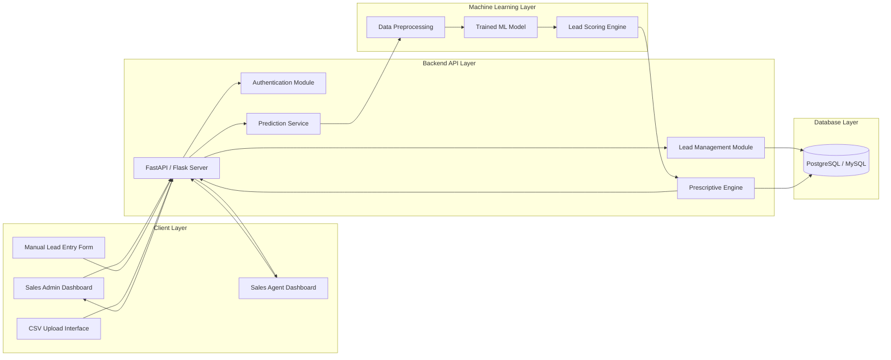
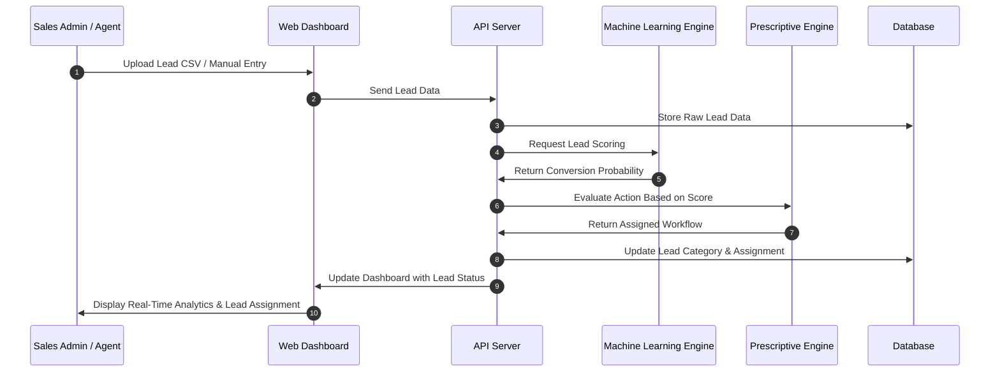
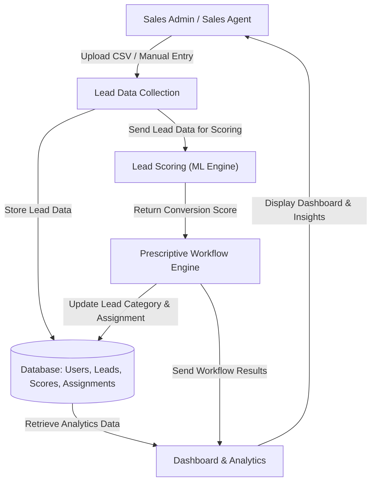
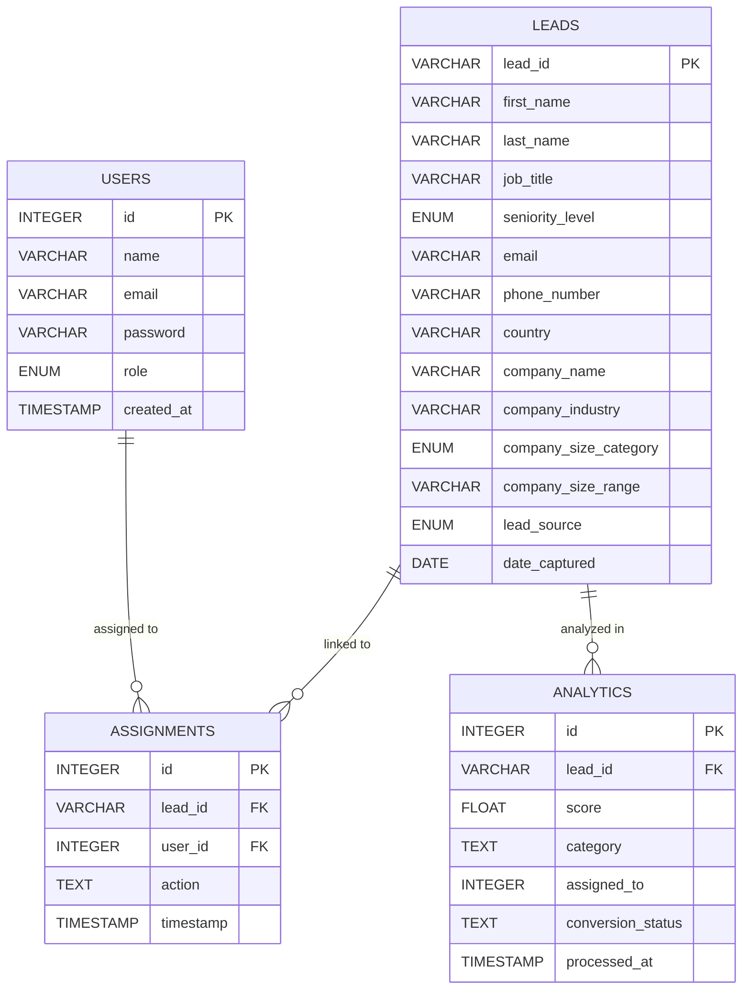

# Intelligent Sales Automation SaaS
### With Prescriptive Lead Scoring & Automated Workflow Execution

---

## 1. Project Overview

The **Intelligent Sales Automation SaaS** is a web-based system designed to automate lead management using machine learning.

The system:
- Predicts **lead conversion probability**
- Automatically executes **prescriptive workflow actions**
- Reduces manual sales effort
- Improves sales team efficiency
- Supports data-driven decision making

This project is developed as a **Final Year Project**.

### Problem Statement
Traditional sales processes rely heavily on:
- Manual lead qualification  
- Guess-based prioritization  
- Delayed follow-ups  
- Non-optimized lead routing

This leads to:
- Missed high-value leads  
- Wasted sales effort  
- Poor conversion rates  
There is a need for an **intelligent, automated, scalable solution**.

###  Solution
This project introduces:
- Machine Learning–Based Lead Scoring  
- Automated Workflow Engine  
- Prescriptive Action Recommendation  
- Real-Time Dashboard Analytics  
- SaaS-Based Multi-User Architecture  

---
## 2. Core Features

### 1️⃣ Intelligent Lead Scoring
- Uses ML model to predict conversion probability
- Outputs score between 0 – 100%
- Automatically categorizes:
  - High Intent
  - Medium Intent
  - Low Intent

### 2️⃣ Prescriptive Workflow Engine
Based on prediction:

| Score Range | Action |
|------------|--------|
| 80 – 100% | Route to Senior Sales Agent |
| 50 – 79%  | Assign to Regular Sales Rep |
| 0 – 49%   | Add to Nurturing Campaign |

### 3️⃣ Automated Lead Routing
- No manual assignment
- Dynamic distribution logic

### 4️⃣ Real-Time Dashboard
- Conversion rate
- Lead distribution
- Agent performance
- Funnel visualization

### 5️⃣ Hybrid Lead Input System + Manual Entry
- Bulk dataset ingestion
- Optional manual lead entry
- CSV upload supported

## 3. Technology Stack
The Intelligent Sales Automation SaaS is built using a modern, scalable, and modular technology stack that supports intelligent processing, automation, and real-time analytics.

### Frontend
- **React.js** (or Vanilla JavaScript) – User interface development  
- **Bootstrap 5** – Responsive design and layout styling  
- **Chart.js** – Data visualization and dashboard analytics  

### Backend
- **Python** – Core programming language  
- **FastAPI / Flask** – RESTful API development and request handling  

### Machine Learning
- **Scikit-learn** – Model training and prediction  
- **Pandas** – Data manipulation and preprocessing  
- **NumPy** – Numerical computations  

### Database
- **PostgreSQL / MySQL** – Relational database management  
- **SQLAlchemy ORM** – Database abstraction and query handling  

### Authentication & Security
- **JWT (JSON Web Tokens)** – Secure user authentication  
- **bcrypt** – Password hashing and encryption  

### Deployment & DevOps
- **Docker** – Containerization  
- **Render / Railway / AWS** – Cloud hosting and deployment  
This stack ensures that the system remains scalable, maintainable, secure, and capable of handling intelligent automation at scale.
---
## 4. System Architecture Overview
The Intelligent Sales Automation SaaS adopts a **modular multi-tier architecture** that separates user interaction, business logic, machine learning intelligence, and data storage. This structured separation ensures **scalability, maintainability, and system flexibility**, while allowing both technical and non-technical stakeholders to clearly understand how the system operates.

At the **Client Layer**, users such as Sales Administrators and Sales Agents access the system through a web-based dashboard. This interface enables:
- Lead dataset upload (CSV ingestion)
- Manual lead entry
- Real-time monitoring of lead scores and assignments
- Performance and conversion analytics visualization  

The **Backend API Layer** functions as the core control center of the application. It handles:
- User authentication and authorization  
- Lead data validation and processing  
- Communication with the Machine Learning services  
- Execution of business rules through the prescriptive engine  

This layer ensures secure, structured communication between the frontend interface and the internal intelligence components.

The **Machine Learning Layer** provides the system’s decision-making capability. Incoming lead data undergoes preprocessing and feature transformation before being evaluated by a trained predictive model. The model generates a **conversion probability score**, which is then interpreted by the *Prescriptive Engine*. Based on predefined business thresholds, the engine determines the most appropriate action, such as prioritizing high-intent leads or placing low-intent leads into nurturing workflows.

The **Data Layer** is responsible for persistent storage of all critical system information, including:
- User accounts and roles  
- Lead records and attributes  
- Prediction scores and lead categories  
- Assignment history and activity logs  

This ensures data consistency, traceability, and reliable analytics reporting.

**Data Flow:** Lead information enters the system through manual input or bulk upload at the Client Layer. The Backend processes and forwards the data to the Machine Learning Layer for scoring. The generated prediction is evaluated by the Prescriptive Engine, which assigns a workflow action. The final lead status, score, and routing decision are stored in the database and reflected instantly on the user dashboard.

Overall, this architecture ensures that the system remains **intelligent, automated, and scalable**, while maintaining clear separation between presentation, processing, predictive intelligence, and storage components.

### 🏗️ System Architecture Diagram

## 5. System Flow (Runtime Behavior)

## 6. Data Flow Diagram (DFD) – Level 1

## 7. Database Design

The system uses a **relational database** (PostgreSQL / MySQL) to store users, leads, prediction scores, lead categories, and assignment history. The database is designed to ensure **data integrity, scalability, and traceability**.

---

### Users Table

| Column      | Type      | Description                     |
|------------|-----------|---------------------------------|
| id         | INTEGER   | Primary Key                     |
| name       | VARCHAR   | Full Name of the User           |
| email      | VARCHAR   | Unique Email Address            |
| password   | VARCHAR   | Hashed Password                 |
| role       | ENUM      | Role of the User (Admin / Sales)|
| created_at | TIMESTAMP | Account Creation Timestamp      |

---

### Leads Table

| Column Name           | Data Type | Description |
|-----------------------|-----------|-------------|
| Lead ID               | VARCHAR   | Unique Key (e.g., L-1024) |
| First Name            | VARCHAR   | Lead's First Name |
| Last Name             | VARCHAR   | Lead's Last Name |
| Job Title             | VARCHAR   | Official Title (e.g., VP of Sales) |
| Seniority Level       | ENUM      | Bucket (C-suite, VP, Director, Manager, etc.) |
| Email                 | VARCHAR   | Business Email |
| Phone Number          | VARCHAR   | Contact Number |
| Country               | VARCHAR   | Location |
| Company Name          | VARCHAR   | Name of the organization |
| Company Industry      | VARCHAR   | Sector (SaaS, Finance, Consulting, etc.) |
| Company Size Category | ENUM      | Bucket (Startup, Enterprise, etc.) |
| Company Size Range    | VARCHAR   | Numeric range (e.g., 1000+) |
| Lead Source           | ENUM      | Attribution (Webinar, LinkedIn, Referral, etc.) |
| Date Captured         | DATE      | When they entered the system (automatically captured) |

---

### Assignments Table

| Column     | Type    | Description                       |
|-----------|---------|-----------------------------------|
| id        | INTEGER | Primary Key                       |
| lead_id   | VARCHAR | Reference to Leads Table (Lead ID)|
| user_id   | INTEGER | Reference to Users Table           |
| action    | TEXT    | Workflow Action Taken              |
| timestamp | TIMESTAMP | Action Execution Time             |

---

### Analytics Table (Optional / Aggregated Data)

| Column         | Type     | Description                         |
|----------------|----------|-------------------------------------|
| id             | INTEGER  | Primary Key                         |
| lead_id        | VARCHAR  | Reference to Leads Table            |
| score          | FLOAT    | Prediction Score                    |
| category       | TEXT     | Lead Category                        |
| assigned_to    | INTEGER  | Sales Agent ID                       |
| conversion_status | TEXT  | Converted / Not Converted            |
| processed_at   | TIMESTAMP | Time of Scoring / Assignment        |

---

### Database ER Diagram

## 8. Roles & Permissions

| Role  | Description                     | Permissions / Access Rights |
|-------|---------------------------------|----------------------------|
| Admin | Full system administrator       | - View all leads and analytics - Assign leads to any sales agent - Manage users (add, edit, remove) - Configure workflows and system settings - Access all dashboards and reports |
| Sales | Sales team member / agent       | - View assigned leads only - Update lead status and perform workflow actions - Access personal dashboard and performance analytics - Cannot manage other users or system settings |

## 9. Evaluation Metrics
To ensure the Intelligent Sales Automation SaaS performs effectively, the system is evaluated using both **machine learning metrics** and **business-focused metrics**.
### Machine Learning Metrics
These metrics assess how accurately the system predicts lead conversion:
- **Accuracy**: Proportion of correctly predicted lead outcomes (converted / not converted).  
- **Precision**: Fraction of leads predicted as high-conversion that actually converted.  
- **Recall (Sensitivity)**: Fraction of actual converted leads that were correctly identified.  
- **F1 Score**: Harmonic mean of precision and recall; balances false positives and false negatives.  
- **ROC-AUC**: Measures the ability of the model to distinguish between converted and non-converted leads.  

### Business / Functional Metrics
These metrics measure system effectiveness from a sales perspective:
- **Lead Conversion Rate**: Percentage of leads successfully converted into customers.  
- **Average Response Time**: Time taken for the system to assign leads and initiate workflows.  
- **Lead Assignment Accuracy**: Percentage of leads routed to the appropriate agent based on score and workflow rules.  
- **User Engagement**: Frequency and activity of Sales Agents interacting with the system and dashboards.  

By combining ML performance metrics with business-oriented KPIs, the system can be **continuously monitored and optimized** to improve lead prioritization, automation efficiency, and overall sales effectiveness.
