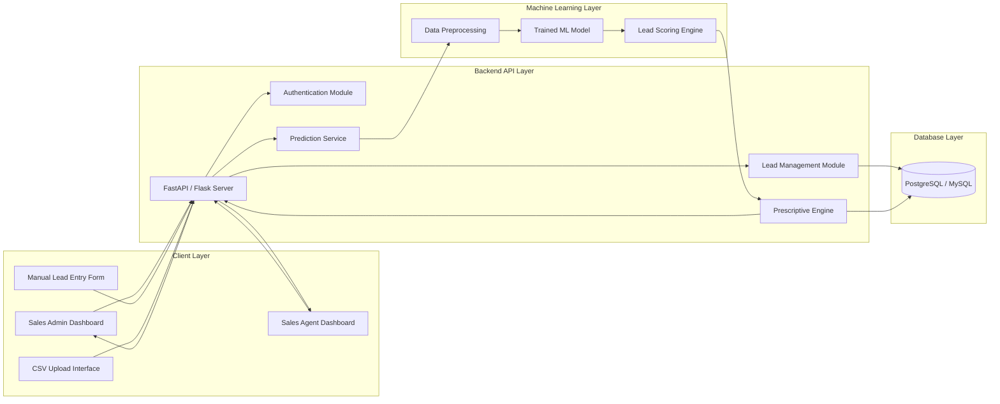
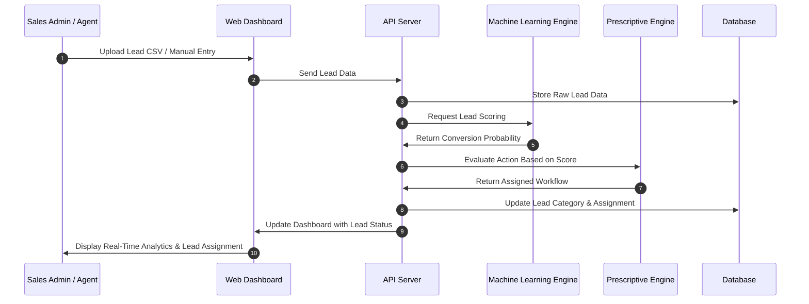
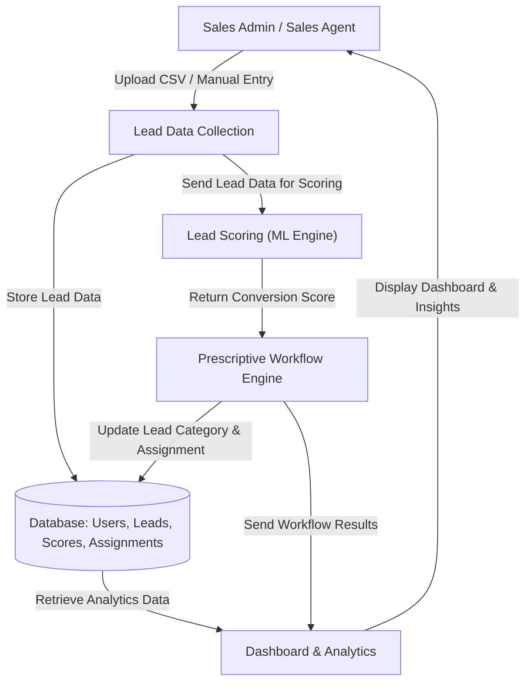
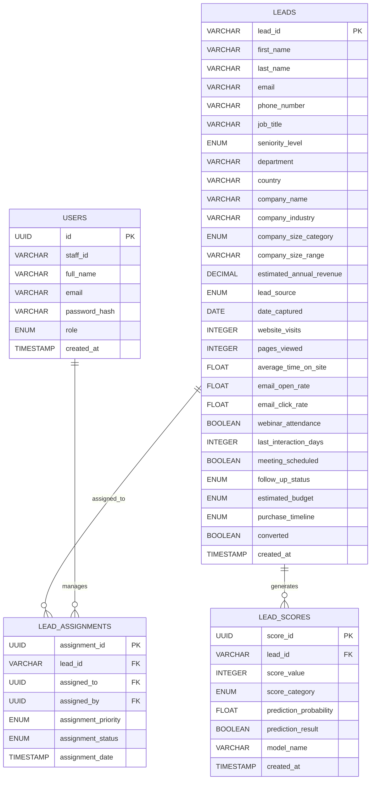

# Intelligent Sales Automation SaaS
### With Prescriptive Lead Scoring & Automated Workflow Execution

---
Reop: https://github.com/MichealAniC/Intelligenet-Sales-Automation-Saas)
## 1. Project Overview

The **Intelligent Sales Automation SaaS** is a web-based system designed to automate lead management using machine learning.

The system:
- Predicts **lead conversion probability**
- Automatically executes **prescriptive workflow actions**
- Reduces manual sales effort
- Improves sales team efficiency
- Supports data-driven decision making

This project is developed as a **Final Year Project**.


### Problem Statement
Traditional sales processes rely heavily on:
- Manual lead qualification  
- Guess-based prioritization  
- Delayed follow-ups  
- Non-optimized lead routing

This leads to:
- Missed high-value leads  
- Wasted sales effort  
- Poor conversion rates  
There is a need for an **intelligent, automated, scalable solution**.

###  Solution
This project introduces:
- Machine Learning–Based Lead Scoring  
- Automated Workflow Engine  
- Prescriptive Action Recommendation  
- Real-Time Dashboard Analytics  
- SaaS-Based Multi-User Architecture  

---
## 2. Core Features

### 1️⃣ Intelligent Lead Scoring
- Uses ML model to predict conversion probability
- Outputs score between 0 – 100%
- Automatically categorizes:
  - High Intent
  - Medium Intent
  - Low Intent

### 2️⃣ Prescriptive Workflow Engine
Based on prediction:

| Score Range | Action |
|------------|--------|
| 80 – 100% | Route to Senior Sales Agent |
| 50 – 79%  | Assign to Regular Sales Rep |
| 0 – 49%   | Add to Nurturing Campaign |

### 3️⃣ Automated Lead Routing
- No manual assignment
- Dynamic distribution logic

### 4️⃣ Real-Time Dashboard
- Conversion rate
- Lead distribution
- Agent performance
- Funnel visualization

### 5️⃣ Hybrid Lead Input System + Manual Entry
- Bulk dataset ingestion
- Optional manual lead entry
- CSV upload supported

## 3. Technology Stack
The Intelligent Sales Automation SaaS is built using a modern, scalable, and modular technology stack that supports intelligent processing, automation, and real-time analytics.

### Frontend
- **React.js** (or Vanilla JavaScript) – User interface development  
- **Bootstrap 5** – Responsive design and layout styling  
- **Chart.js** – Data visualization and dashboard analytics  

### Backend
- **Python** – Core programming language  
- **FastAPI / Flask** – RESTful API development and request handling  

### Machine Learning
- **Scikit-learn** – Model training and prediction  
- **Pandas** – Data manipulation and preprocessing  
- **NumPy** – Numerical computations  

### Database
- **PostgreSQL / MySQL** – Relational database management  
- **SQLAlchemy ORM** – Database abstraction and query handling  

### Authentication & Security
- **JWT (JSON Web Tokens)** – Secure user authentication  
- **bcrypt** – Password hashing and encryption  

### Deployment & DevOps
- **Docker** – Containerization  
- **Render / Railway / AWS** – Cloud hosting and deployment  
This stack ensures that the system remains scalable, maintainable, secure, and capable of handling intelligent automation at scale.
---
## 4. System Architecture Overview
The Intelligent Sales Automation SaaS adopts a **modular multi-tier architecture** that separates user interaction, business logic, machine learning intelligence, and data storage. This structured separation ensures **scalability, maintainability, and system flexibility**, while allowing both technical and non-technical stakeholders to clearly understand how the system operates.

At the **Client Layer**, users such as Sales Administrators and Sales Agents access the system through a web-based dashboard. This interface enables:
- Lead dataset upload (CSV ingestion)
- Manual lead entry
- Real-time monitoring of lead scores and assignments
- Performance and conversion analytics visualization  

The **Backend API Layer** functions as the core control center of the application. It handles:
- User authentication and authorization  
- Lead data validation and processing  
- Communication with the Machine Learning services  
- Execution of business rules through the prescriptive engine  

This layer ensures secure, structured communication between the frontend interface and the internal intelligence components.

The **Machine Learning Layer** serves as the intelligent decision-making component of the system. Incoming lead data is first subjected to preprocessing operations such as data cleaning, feature selection, categorical encoding, and feature transformation to prepare the dataset for prediction. The processed features are then evaluated using a trained **Random Forest Classification Model** to predict the likelihood of lead conversion.

The model generates a **conversion probability score** and corresponding lead classification, indicating whether a lead is likely to convert into a customer. These prediction results are forwarded to the **Prescriptive Engine**, which applies predefined business rules and decision thresholds to determine the most suitable sales action.

Based on the generated lead score and conversion probability, the system can:

- Prioritize high-intent leads for immediate follow-up
- Assign qualified leads to sales representatives
- Categorize leads as Hot, Warm, or Cold
- Route low-intent leads into nurturing workflows
- Support automated sales decision-making and lead management

This architecture enables intelligent lead prioritization, improves sales efficiency, and supports data-driven customer acquisition strategies.

The **Data Layer** is responsible for persistent storage of all critical system information, including:
- User accounts and roles  
- Lead records and attributes  
- Prediction scores and lead categories  
- Assignment history and activity logs  

This ensures data consistency, traceability, and reliable analytics reporting.

**Data Flow:** Lead information enters the system through manual input or bulk upload at the Client Layer. The Backend processes and forwards the data to the Machine Learning Layer for scoring. The generated prediction is evaluated by the Prescriptive Engine, which assigns a workflow action. The final lead status, score, and routing decision are stored in the database and reflected instantly on the user dashboard.

Overall, this architecture ensures that the system remains **intelligent, automated, and scalable**, while maintaining clear separation between presentation, processing, predictive intelligence, and storage components.

### 🏗️ System Architecture Diagram

```mermaid
flowchart LR

%% =========================
%% CLIENT LAYER
%% =========================
subgraph Client Layer
    A[Sales Admin Dashboard]
    B[Sales Agent Dashboard]
    C[Manual Lead Entry Form]
    D[CSV Upload Interface]
end

%% =========================
%% API LAYER
%% =========================
subgraph Backend API Layer
    E[FastAPI / Flask Server]
    F[Authentication Module]
    G[Lead Management Module]
    H[Prediction Service]
    I[Prescriptive Engine]
end

%% =========================
%% ML LAYER
%% =========================
subgraph Machine Learning Layer
    J[Data Preprocessing]
    K[Trained ML Model]
    L[Lead Scoring Engine]
end

%% =========================
%% DATABASE LAYER
%% =========================
subgraph Database Layer
    M[(PostgreSQL / MySQL)]
end

%% =========================
%% FLOW CONNECTIONS
%% =========================

A --> E
B --> E
C --> E
D --> E

E --> F
E --> G
G --> M

E --> H
H --> J
J --> K
K --> L
L --> I

I --> M
I --> E

E --> A
E --> B
```
## 5. System Flow (Runtime Behavior)


```mermaid
sequenceDiagram
    autonumber
    participant User as Sales Admin / Agent
    participant Frontend as Web Dashboard
    participant Backend as API Server
    participant ML as Machine Learning Engine
    participant Prescriptive as Prescriptive Engine
    participant DB as Database

    User->>Frontend: Upload Lead CSV / Manual Entry
    Frontend->>Backend: Send Lead Data
    Backend->>DB: Store Raw Lead Data
    Backend->>ML: Request Lead Scoring
    ML->>Backend: Return Conversion Probability
    Backend->>Prescriptive: Evaluate Action Based on Score
    Prescriptive->>Backend: Return Assigned Workflow
    Backend->>DB: Update Lead Category & Assignment
    Backend->>Frontend: Update Dashboard with Lead Status
    Frontend->>User: Display Real-Time Analytics & Lead Assignment
```

## 6. Data Flow Diagram (DFD) – Level 1


```mermaid
flowchart TD
    %% External Entities
    User["Sales Admin / Sales Agent"]

    %% Processes
    P1["Lead Data Collection"]
    P2["Lead Scoring (ML Engine)"]
    P3["Prescriptive Workflow Engine"]
    P4["Dashboard & Analytics"]

    %% Data Stores
    D1[("Database: Users, Leads, Scores, Assignments")]

    %% Data Flow
    User -->|"Upload CSV / Manual Entry"| P1
    P1 -->|"Store Lead Data"| D1
    P1 -->|"Send Lead Data for Scoring"| P2
    P2 -->|"Return Conversion Score"| P3
    P3 -->|"Update Lead Category & Assignment"| D1
    P3 -->|"Send Workflow Results"| P4
    D1 -->|"Retrieve Analytics Data"| P4
    P4 -->|"Display Dashboard & Insights"| User
```
## 7. Database Design

The system uses a **relational database management system (PostgreSQL / MySQL)** to manage users, lead records, machine learning predictions, lead scores, and assignment workflows. The database architecture is designed to support:

- Lead management and tracking
- Machine learning feature storage
- Lead scoring and prediction history
- Sales assignment workflows
- System scalability and maintainability
- Data integrity and relational consistency

The database structure separates:

- Core lead data
- Machine learning prediction data
- Operational assignment workflows

This separation improves database normalization and ensures a clean architecture between the machine learning layer and sales operations layer.

### Core Database Tables
1. Users Table
2. Leads Table
3. Lead Scores Table
4. Lead Assignments Table

### Users Table
Stores authenticated system users including administrators, managers, and sales representatives.

| Column Name | Data Type | Description |
|---|---|---|
| id | UUID | Primary key |
| staff_id | VARCHAR | Unique staff identifier (e.g., ADM-001, MGR-101, SAL-205) |
| full_name | VARCHAR | Full name of the user |
| email | VARCHAR | Unique email address |
| password_hash | VARCHAR | Encrypted password |
| role | ENUM | User role (Admin, Manager, Sales Rep) |
| created_at | TIMESTAMP | Account creation timestamp |

### Leads Table
Stores lead information and machine learning features used for predictive lead scoring.

| Column Name | Data Type | Description |
|---|---|---|
| lead_id | VARCHAR | Unique identifier for each lead (e.g., L-1024) |
| first_name | VARCHAR | Lead's first name |
| last_name | VARCHAR | Lead's last name |
| email | VARCHAR | Business email address |
| phone_number | VARCHAR | Contact phone number |
| job_title | VARCHAR | Official professional role of the lead |
| seniority_level | ENUM | Organizational level (C-Suite, VP, Director, Manager, Staff, etc.) |
| department | VARCHAR | Department of the lead |
| country | VARCHAR | Lead’s country or region |
| company_name | VARCHAR | Name of the organization |
| company_industry | VARCHAR | Industry sector of the company |
| company_size_category | ENUM | Company classification (Startup, SMB, Mid-Market, Enterprise) |
| company_size_range | VARCHAR | Approximate employee size range |
| estimated_annual_revenue | DECIMAL | Estimated yearly company revenue |
| lead_source | ENUM | Source where the lead originated (LinkedIn, Webinar, Referral, Ads, Website, etc.) |
| date_captured | DATE | Date the lead entered the system |
| website_visits | INTEGER | Total number of visits to the company website |
| pages_viewed | INTEGER | Number of pages viewed by the lead |
| average_time_on_site | FLOAT | Average session duration in minutes |
| email_open_rate | FLOAT | Percentage of marketing emails opened |
| email_click_rate | FLOAT | Percentage of email links clicked |
| webinar_attendance | BOOLEAN | Indicates whether the lead attended a webinar |
| last_interaction_days | INTEGER | Number of days since the last interaction |
| meeting_scheduled | BOOLEAN | Indicates whether a sales meeting was scheduled |
| follow_up_status | ENUM | Response status after follow-up (Positive, Neutral, Negative, No Response) |
| estimated_budget | ENUM | Estimated purchasing budget (Low, Medium, High) |
| purchase_timeline | ENUM | Expected purchase timeframe (Immediate, 1-3 Months, 3-6 Months, Future) |
| converted | BOOLEAN | Target label indicating whether the lead became a customer |
| created_at | TIMESTAMP | Record creation timestamp |

### Lead Scores Table
Stores machine learning prediction results and generated lead scores.

| Column Name | Data Type | Description |
|---|---|---|
| score_id | UUID | Primary key |
| lead_id | VARCHAR | Reference to related lead |
| score_value | INTEGER | Generated lead score |
| score_category | ENUM | Lead category (Hot, Warm, Cold) |
| prediction_probability | FLOAT | Predicted conversion probability |
| prediction_result | BOOLEAN | Predicted conversion outcome |
| model_name | VARCHAR | Machine learning algorithm used |
| created_at | TIMESTAMP | Prediction generation timestamp |

---

## Lead Assignments Table
Stores post-prediction lead assignment and sales workflow information.

| Column Name | Data Type | Description |
|---|---|---|
| assignment_id | UUID | Primary key |
| lead_id | VARCHAR | Reference to related lead |
| assigned_to | UUID | Assigned sales representative |
| assigned_by | UUID | Manager or admin assigning the lead |
| assignment_priority | ENUM | Lead priority level (Hot, Warm, Cold) |
| assignment_status | ENUM | Assignment status (Assigned, In Progress, Completed) |
| assignment_date | TIMESTAMP | Date and time of assignment |


### Database Relationships
| Parent Table | Child Table | Relationship |
|---|---|---|
| users | lead_assignments | One-to-Many |
| leads | lead_scores | One-to-Many |
| leads | lead_assignments | One-to-Many |


### Database Workflow
The database workflow follows the machine learning pipeline of the system.

```text
Lead Capture
    ↓
Lead Storage
    ↓
Data Preprocessing
    ↓
Machine Learning Prediction
    ↓
Lead Score Generation
    ↓
Lead Categorization
    ↓
Lead Assignment
```

### Machine Learning Data Usage

The **Leads Table** serves as the primary machine learning dataset.

During training:

- Predictive features are extracted from the leads table
- The `converted` column acts as the target label
- The model learns conversion patterns from historical lead data

After prediction:

- Results are stored in the `lead_scores` table
- Qualified leads are distributed using the `lead_assignments` table

This architecture separates machine learning prediction from operational sales workflow management.
---

### Database ER Diagram


```mermaid
erDiagram

    USERS {
        UUID id PK
        VARCHAR staff_id
        VARCHAR full_name
        VARCHAR email
        VARCHAR password_hash
        ENUM role
        TIMESTAMP created_at
    }

    LEADS {
        VARCHAR lead_id PK
        VARCHAR first_name
        VARCHAR last_name
        VARCHAR email
        VARCHAR phone_number
        VARCHAR job_title
        ENUM seniority_level
        VARCHAR department
        VARCHAR country
        VARCHAR company_name
        VARCHAR company_industry
        ENUM company_size_category
        VARCHAR company_size_range
        DECIMAL estimated_annual_revenue
        ENUM lead_source
        DATE date_captured
        INTEGER website_visits
        INTEGER pages_viewed
        FLOAT average_time_on_site
        FLOAT email_open_rate
        FLOAT email_click_rate
        BOOLEAN webinar_attendance
        INTEGER last_interaction_days
        BOOLEAN meeting_scheduled
        ENUM follow_up_status
        ENUM estimated_budget
        ENUM purchase_timeline
        BOOLEAN converted
        TIMESTAMP created_at
    }

    LEAD_SCORES {
        UUID score_id PK
        VARCHAR lead_id FK
        INTEGER score_value
        ENUM score_category
        FLOAT prediction_probability
        BOOLEAN prediction_result
        VARCHAR model_name
        TIMESTAMP created_at
    }

    LEAD_ASSIGNMENTS {
        UUID assignment_id PK
        VARCHAR lead_id FK
        UUID assigned_to FK
        UUID assigned_by FK
        ENUM assignment_priority
        ENUM assignment_status
        TIMESTAMP assignment_date
    }

    LEADS ||--o{ LEAD_SCORES : generates
    LEADS ||--o{ LEAD_ASSIGNMENTS : assigned_to
    USERS ||--o{ LEAD_ASSIGNMENTS : manages
```
## 8. Roles & Permissions

| Role  | Description                     | Permissions / Access Rights |
|-------|---------------------------------|----------------------------|
| Admin | Full system administrator       | - View all leads and analytics<br>- Assign leads to any sales agent<br>- Manage users (add, edit, remove)<br>- Configure workflows and system settings<br>- Access all dashboards and reports |
| Sales | Sales team member / agent       | - View assigned leads only<br>- Update lead status and perform workflow actions<br>- Access personal dashboard and performance analytics<br>- Cannot manage other users or system settings |

## 9. Evaluation Metrics
To ensure the Intelligent Sales Automation SaaS performs effectively, the system is evaluated using both **machine learning metrics** and **business-focused metrics**.
### Machine Learning Metrics
These metrics assess how accurately the system predicts lead conversion:
- **Accuracy**: Proportion of correctly predicted lead outcomes (converted / not converted).  
- **Precision**: Fraction of leads predicted as high-conversion that actually converted.  
- **Recall (Sensitivity)**: Fraction of actual converted leads that were correctly identified.  
- **F1 Score**: Harmonic mean of precision and recall; balances false positives and false negatives.  
- **ROC-AUC**: Measures the ability of the model to distinguish between converted and non-converted leads.  

### Business / Functional Metrics
These metrics evaluate the effectiveness of the system from a sales and operational perspective:
- **Lead Conversion Rate**: Measures the percentage of leads successfully converted into customers.
- **Lead Assignment Efficiency**: Measures how quickly and accurately leads are assigned after prediction and scoring.
- **Prediction Effectiveness**: Evaluates how well the machine learning model identifies high-potential leads.
- **User Activity**: Tracks how actively sales representatives interact with assigned leads and system dashboards.
By combining ML performance metrics with business-oriented KPIs, the system can be **continuously monitored and optimized** to improve lead prioritization, automation efficiency, and overall sales effectiveness.
